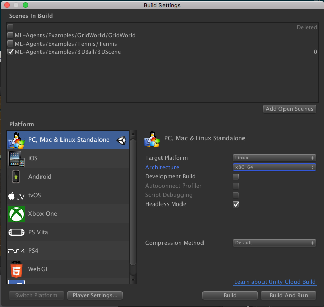

# Using Docker For ML Agents (Experimental)

We are currently offering an experimental solution for Windows and Mac users who would like to do training or inference using Docker. This option may be appealing to users who would like to avoid dealing with Python and TensorFlow installation on their host machines. This setup currently forces both TensorFlow and Unity to rely on _only_ the CPU for computation purposes. As such, we currently only support training using environments that only contain agents which use vector observations, rather than camera-based visual observations. For example, the [GridWorld](Example-Environments.md#gridworld) environment which use visual observations for training is not supported. 

## Requirements
- Unity Linux Standalone Player ([Link](https://unity3d.com/get-unity/download?ref=professional&_ga=2.161111422.259506921.1519336396-1357272041.1488299149))
- Docker ([Link](https://www.docker.com/community-edition#/download))

## Setup

- Install Docker (see link above) if you don't have it setup on your machine. 

- Since Docker runs a container in an environment that is isolated from the host machine, we will be using a mounted directory, e.g. `unity-volume` in your host machine in order to share data, e.g. the Unity executable, curriculum files and tensorflow graph.

## Usage

- Docker typically runs a container sharing a (linux) kernel with the host machine, this means that the 
Unity environment **has** to be built for the **linux platform**. From the Build Settings Window, please select the architecture to be `x86_64` and choose the build to be `headless` (_This is important because we are running it in a container that does not have graphics drivers installed_). 
Save the generated environment in the directory to be mounted (e.g. we have conveniently created an empty directory called at the top level `unity-volume`). 



- Ensure that `unity-volume/<environment-name>.x86_64` and `unity-volume/environment-name_Data`. So for example, `<environment_name>` might be `3Dball` and you might want to ensure that `unity-volume/3Dball.x86_64` and `unity-volume/3Dball_Data` are both present in the directory `unity-volume`.

- Make sure the docker engine is running on your machine, then go to the top level of the source directory where the `Dockerfile` is present. Now build the docker container using the following command:


```
docker build  -t <image_name> .
```

Replace `<image_name>` by the name of the image that you want to use, e.g. `balance.ball.v0.1`.

- Run the container:

```
docker run --mount type=bind,source="$(pwd)"/unity-volume,target=/unity-volume \
	 <image-name>:latest <environment-name> \
	 --docker-target-name=unity-volume \
	 --train --run-id=<run-id>
```

For the `3DBall` environment, for example this would be:

- Run the container:

```
docker run --mount type=bind,source="$(pwd)"/unity-volume,target=/unity-volume \
	 balance.ball.v0.1:latest 3Dball \
	 --docker-target-name=unity-volume \
	 --train --run-id=<run-id>
```

**Notes on argument values** 

- `source` : Reference to the path in your host OS where you will store the Unity executable. 
- `target`: Tells docker to mount the `source` path as a disk with this name. 
- `docker-target-name`: Tells the ML-Agents python package what the name of the disk where it can read the Unity executable and store the graph.**This should therefore be identical to the `target`.**
- `train`, `run-id`: ML-Agents arguments passed to `learn.py`. `train` trains the algorithm, `run-id` is used to tag each experiment with a unique id. 


For more details on docker mounts, look at [these](https://docs.docker.com/storage/bind-mounts/) docs from Docker.


